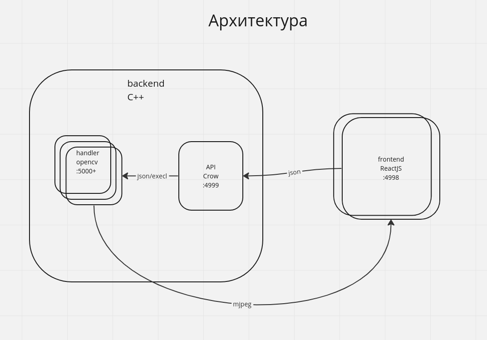

# TrueTechHack by Пажилой Пивальди

Видео-презентация: https://youtu.be/p5IKOTBnHvk \
Ссылка на решение на VM: (работает только фронт): http://91.185.86.201:4998 \
Ссылка на презентацию: https://docs.google.com/presentation/d/1HftpXSpUKzNwx5xZpV8c5fG_lh0ATqJALy3a1i-sawQ/edit?usp=sharing

## Состав команды
Иван Павлов - капитан, архитектор, бэкенд (внедрение алгоритмов, многопроцессность), девопс.\
Арсений Соколов - алгоритмы opencv, UI/UX дизайн.\
Артемий Крючков - frontend.\
Илья Лютоев - бэкенд (api).

## Стек технологий
backend: C++, Crow, unistd.h, ZMQ, nlohmann::json, opencv, mjpeg\
frontend: Js, React, vite, axios, react-router-dom, react-hook-form, sass, tailwindcss

## Архитектура:


## Описание алгоритмов:
В рамках проекта реализовали алгоритмы для комфортного просмотра видео для людей с нарушением цветовосприятия и эпилепсией.

Существует несколько типов нарушения цветовосприятия, при котором человек не может отличить определенные цвета.
Проведя опрос среди англоязычной аудитории пользователь с дальтонизмом на Reddit, мы узнали, что особых проблем при просмотре
видео контента у них нет, однако у людей с наршуением цветовосприятия возникают проблемы с тем, чтобы различать цвета
в определенном спектре. Это происходит всвязи с тем, что колбочки отвечающее за распознование длин света определнной длины
смещают свой диапозон. Решить эту проблему могут энхроматические очки, блокирующие световые волны определенной длины.
Ознакомившись с научными статьями по цветовосприятию и вычислив экспериментально оптимальное цветовое смешение при
помощи эмуляции дальтонизма, мы реализовали алгоритм смещения цветовой гаммы на видео, позволяющий людям с
дейтеранопией, протанопией и тританопией намного лучше различать друг от друга проблемные цвета.

При работе с эпилепсией мы узнали, что это понятия крайне общее, однако существуют определенные условия, которые при
просмотре видеоконтента могут вызвать эпилептический припадок. Например быстрое изменение цвета или яркости, или
контрастные геометрические узоры. При анализе видео опасных для людей с эпилепсией мы вычеслили опасные значения
изменения ярокости, контрастности и цвета между кадрами видео и реализовали алгоритм фильтрации опасных кадров
защитным предупреждением о возможном содержании эпилептических сцен.

Помимо прочего мы также сделали фильтры для комфортного просмотра видео: изменения яркости, контрастности, насыщенности,
цветовой гаммы, и фильтр синего для ночного просмотра без усталости для глаз.


## Описание фронтенда:
Реализовано 4 страницы: главная страница с выбором фильмов, страница фильма, регистрация, логин. На главной странице есть на выбор из четырёх фильмов. Если нажать на картинку фильма перекидывает на его страницу, где при нажатии на кнопку "play" отправляется запрос на бэкенд и после перезагрузки страницы воспроизводится фильм. Реализованы кнопки паузы, перемотки, режимы для эпилептиков, дальтоников, ночной режим, а также кнопки для настройки яркости, контрастности, насыщенности и оттенка.

## Описание бэкенда:
Есть API, написанное на фреймворке Crow. У api есть роутеры:
- /create - принимает json {"login": str, "filmName": str}. По логину вычисляет id, все это лежит в std::map и std::vector, но вообще нужен Redis. создает новый обработчик системным вызовом fork(), системным вызовом exec() запускает обработчик, передавая ему порт (вычисляется по id) и название фильма. Затем  посредством zeromq получает из обработчика порт, на котором будут стримиться видео, и запускает видео.
- /pause, /resume - принимают json {"login": str}, передает его на соответствующий обработчик
- /filter - принимает json {"login": str, "filterType": str, "vct": str} - тип фильтра (яркость, контрастность, насыщенность, оттенок, фильтр для дальтоников, для эпилептиков, фильтр синего), "vct" - принимает занчения "left" или "right" в зависимости от того, уменьшаем мы или увеличиваем значение яркости и тд.
- /remove - принимает json {"login": str} - убивает процеесс, освобождает сокет.
На обработчике 2 потока: первый слушает команды из API, ложит их в очередь, второй поток берет команды из очереди, и в зависимости от них обрабатывает видео.

## Описание девопса:
Использовал сервис МТС Compute Cloud (Ubuntu). frontend на нем работает, API он не видит.

## Запуск
работает только на linux\
frontend:
```
cd frontend
yarn
yarn dev
```
backend:
```
cd server/build
cmake ..
make
./api
```
